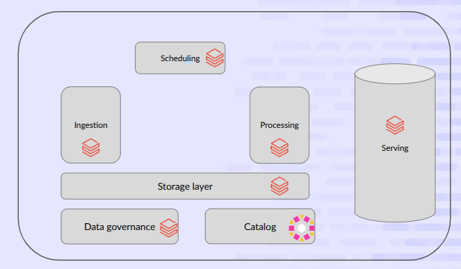

# DBT on Databricks

## Setup

### Prerequisites

Before getting started, ensure you have the following tools installed:
- [Databricks CLI](https://docs.databricks.com/dev-tools/cli/index.html)
- [dbt-databricks](https://docs.getdbt.com/reference/warehouse-setups/databricks-setup) adapter
- [UV](https://docs.astral.sh/uv/) package manager (recommended) or Python 3.8+

## Architecture diagram



### Authentication

Start by installing the Databricks CLI if you haven't already, then authenticate to your workspace:

```bash
# Authenticate with Databricks
databricks auth login
```

Verify your authentication is working correctly:

```bash
# Check available authentication profiles
databricks auth profiles
```

### dbt Connection Test

Test your dbt connection to ensure everything is configured correctly:

```bash
# Test dbt connection (when using UV)
uv run dbt debug --project-dir databricks_conf_analysis --profiles-dir databricks_conf_analysis

# Or if using pip/conda
dbt debug  --project-dir databricks_conf_analysis --profiles-dir databricks_conf_analysis
```

This command will validate your connection to Databricks and confirm that all dependencies are properly installed.

## Running dbt from local pc

### Local Development Workflow

You can execute dbt transformations directly from your local machine, which is ideal for development and testing:

```bash
# Run all dbt models
uv run dbt run --project-dir databricks_conf_analysis --profiles-dir databricks_conf_analysis --vars 'target: dev'

# Run specific models
uv run dbt run --project-dir databricks_conf_analysis --profiles-dir databricks_conf_analysis --vars 'target: dev' --select model_name

# Run models with full refresh
uv run dbt run --project-dir databricks_conf_analysis --profiles-dir databricks_conf_analysis --vars 'target: dev' --full-refresh

# Test data quality
uv run dbt test --project-dir databricks_conf_analysis --profiles-dir databricks_conf_analysis --vars 'target: dev'

# Generate documentation
uv run dbt docs generate --project-dir databricks_conf_analysis --profiles-dir databricks_conf_analysis --vars 'target: dev'
```

### Authentication Method

Local development uses **Personal Access Token (PAT)** authentication for secure connection to Databricks. Ensure your PAT token is properly configured in your environment variables.

## Working with asset bundles

### Target Environments

This project is configured with the following deployment targets:

#### Development Target (`dev`)
- **Purpose**: Local development and testing
- **Asset Naming**: All assets are prefixed with `dev`
- **Job Scheduling**: Jobs are **not** scheduled to run automatically
- **Usage**: Ideal for experimentation and iterative development

### Project Configuration

The deployment targets are centrally defined in the `targets.yaml` file is in the `transform_databricks` directory, providing a single source of truth for environment configuration across all data products in the workspace.

### Asset Bundle Structure

The data product is packaged as a single Databricks Asset Bundle defined in `databricks.yml` and consists of:

#### Jobs Configuration (`bundles/jobs.yml`)
- Contains dbt job definitions optimized for **Databricks Serverless Compute**
- Ensures cost-effective and scalable execution
- Configured with appropriate retry policies and error handling

#### dbt job configuration (`conf_analysis/profiles.yml`)
Since we use the standard dbt `profiles.yml` file for local development, we use the same file for when running dbt on Databricks.
The `DBT_ACCESS_TOKEN` environment variable is automatically set by DBX when running the task.

This project is generated using the standard DBX template, for more information please refer to the [DBX documentation](https://learn.microsoft.com/en-us/azure/databricks/jobs/how-to/use-dbt-in-workflows).

### Deployment Commands

#### Bundle Validation
Always validate your bundle before deployment to catch configuration issues early:

```bash
databricks bundle validate
```

#### Development Deployment
Deploy to the development environment (default target):

```bash
databricks bundle deploy
```

### Best Practices

1. **Always validate** your bundle before deployment
2. **Test in development** before promoting to QA
3. **Monitor job execution** through the Databricks workspace UI
4. **Review data quality metrics** after each deployment
5. **Document any schema changes** for downstream consumers


